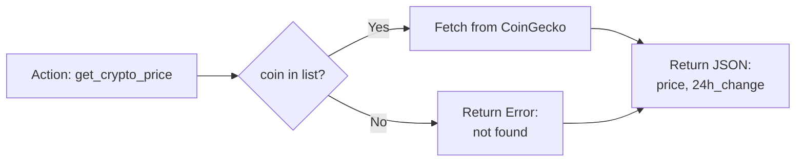
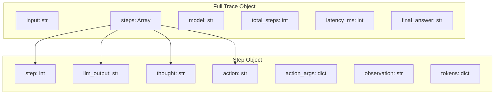

# Crypto Investment Agent - Flowchart

## ReAct Loop Flowchart

```mermaid
flowchart TD
    Start([User Input]) --> BuildPrompt[Build System Prompt<br/>with Tools + ReAct Format]

    BuildPrompt --> LoopEntry{Step < Max Steps?}

    LoopEntry -->|Yes| Generate[LLM.generate<br/>current_prompt<br/>system_prompt]
    LoopEntry -->|No| MaxSteps[Return:<br/>Max Steps Exceeded]

    Generate --> Parse[Parse Response]
    Parse --> Extract{Extract Components}

    Extract -->|Thought| StoreThought[Store Thought<br/>in Step Record]
    Extract -->|Action Found| Execute[Execute Tool<br/>tool_name(args)]
    Extract -->|Final Answer| Return[Return Final Answer]

    StoreThought --> HasAction{Has Action?}

    HasAction -->|Yes| Execute
    HasAction -->|No| NoAction[Append Thought Only<br/>Continue Loop]

    Execute --> Observe[Build Observation<br/>from Tool Result]
    Observe --> Append[Append to Prompt:<br/>Thought + Action + Observation]

    Append --> LoopEntry

    Return --> Output[Return Result + Trace<br/>answer, tokens, latency_ms]
    MaxSteps --> Output
    NoAction --> LoopEntry

    Output --> LogEnd[Log CRYPTO_AGENT_END<br/>to telemetry]
    LogEnd --> Done([Done])
```

## Tool Execution Flow



## Trace Structure


